# Bellabeat Case Study

## Background
Bellabeat is a high-tech company that manufactures health-focused smart products. 
Bellabeat offers a variety of these smart products that are targeted towards women to help inform, inspire and empower them with knowledge about their own health and habits.
Such as their own proprietary app that connects to their line of smart wellness products, a wellness tracker Leaf, a wellness watch Time, a smart water bottle Spring and their subscription-based membership programme.

I am given the task, as a junior data analyst, to find out consumer usage patterns of smart devices and provide insight to inform one of our products' marketing strategies.

<b>Ask</b>

<b>Business Task</b>  
  
Analyse how consumers use non-Bellabeat smart devices to identify usage trends, and apply those trends to one Bellabeat product to inform its marketing strategy.  

<b>Stakeholders </b> 
1. Urška Sršen  
2. Executive team  
3. Marketing Analytics team

<b>Selected Product Focus</b>

Time - A tangible wearable that passively tracks user data without the manual input an app requires. I believe the absence of manual effort makes passive capture more likely to be sustained rather than logging that relies on the user remembering - the analysis that follows tests this rationale. The Fitbit data, being automatically captured activity and sleep data, reflects exactly this kind of passive monitoring.
As Time is bundled with the Bellabeat app as that is where the data syncs to, the analysis will also look into health apps as part of the connected experience. 
Note: the dataset cannot demonstrate retention directly, so this is a market rationale for the product choice, informed by the nature of the data (passive versus manual) rather than a finding the data proves.

 

 <b>Prepare </b>

### Data
#### 1. FitBit Fitness Tracker Data
This dataset is available to download from [Kaggle](https://www.kaggle.com/datasets/arashnic/fitbit?select=mturkfitbit_export_3.12.16-4.11.16) made available through Mobius (CC0: Public Domain).
"This dataset generated by respondents to a distributed survey via Amazon Mechanical Turk between 03.12.2016-05.12.2016. Thirty eligible Fitbit users consented to the submission of personal tracker data, including minute-level output for physical activity, heart rate, and sleep monitoring."

#### Limitations:
a. The dataset sample is small with only 35 users recorded. 
b. This data is from 2016 and spans over only 2 months thus does not fully represent the current consumer market. 
c. There are no demographics recorded in this dataset and as Bellabeat targets the women market, you can't identify which gender these trends come from to apply to Bellabeat.  
d. The daily sleep summary exists only for the second month, so sleep analysis is limited to that period.
e. The brief describes 30 users, but the data contains 35; minor, but noted as a discrepancy between documentation and the actual files. More importantly, the combination of small sample, short time span, age, and absent demographics means all findings from the Fitbit data are treated as light directional indications rather than firm conclusions.

#### Selected FitBit files: mapping to Time's functions
Bellabeat's Time watch tracks activity, sleep, and stress. Wearables do not measure stress directly, they infer it from physical signals such as heart rate (and heart-rate variability), supported by activity and sleep patterns, rather than from a user's thoughts or emotions. The Fitbit files selected below therefore cover all three of Time's functions:

**Activity:** 
dailyActivity_merged.csv (both months)  
hourlyIntensities_merged.csv (both months)  
hourlyStepsmerged.csv (both months)  
hourlyCalories_merged.csv (both months)  
**Sleep:** sleepDay_merged.csv (month 2)  
**Stress (inferred):** heartrate_seconds_merged.csv (both months), as the primary physiological signal from which stress is estimated, supported by the activity and sleep data above

Minute-level files (including minuteMETs) were considered but excluded as redundant with the daily and hourly activity measures already selected, and too granular for the marketing focus of this analysis.

#### 2. Replication Data for: Dataset of motivational factors for using mobile health applications and systems
This dataset is available to download from [dataverse](https://dataverse.no/dataset.xhtml?persistentId=doi:10.18710/AOQF05) (CC0: Public Domain)	
"This dataset contains responses from a questionnaire about what motivates people to collect and share their health data for research and public health benefits. 
The online questionnaire was open for data collection between November 2018 and March 2020. The questionnaire was published in a Norwegian, English and French version, and published online. The questionnaire consisted of 38 questions. A total of 814 participants completed the questionnaire."

##### **Combined Small Considerations**: 
_The behavioural (Fitbit, 2016) and attitudinal (survey, 2018-2020) sources predate the current market. They are used to establish usage patterns and preferences, not as present-day measurements, and are supported by recent market statistics to confirm the broad trends still hold. As the two sources measure different things (behaviour vs attitudes) and are not directly merged, the difference in their collection periods does not affect the analysis._

**Tools used:**  
BigQuery, Sheets, Tableau, and AI assistance for SQL syntax, result mapping and review 

  
<b>Process</b>

### Data Check & Clean
#### Fitbit Data
*Reproduction Logs*  
[Fitbit Data loaded onto BigQuery](01_fitbitdataload.sql)  
[Fitbit Data Process & Clean](02_fitbitdataclean.sql)  
[Fitbit Data Prep & Analysis](03_fitbitdata_prepandanalyse.sql)

#### Survey Data

 
  
<b>Date Standardisation</b>

When loading the data into tables on BigQuery, the date & timestamps of most files could not be loaded without forcing the data type to be STRING.
The first step I took during the cleaning process was to standardise the date & time of each file except for dailyActivity as that was parsed correctly. 

In order to do so, I did a pre-check to ensure the parse works on all rows before committing to a table
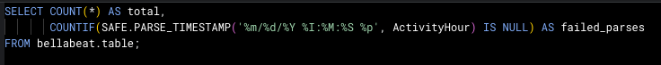

Results:  
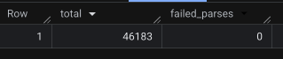  
hourlyCalories, hourlyIntensities & hourlySteps  

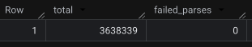  
heartrateSeconds  

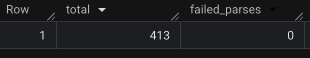  
dailySleep  

With all failed_parses = 0, I went ahead and created cleaned tables.  
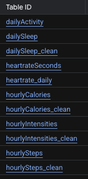  

<b>Quality Check & Further Cleaning</b>
  

1. dailySleep  

a. Ran a check for duplicates and zero activity entries.  
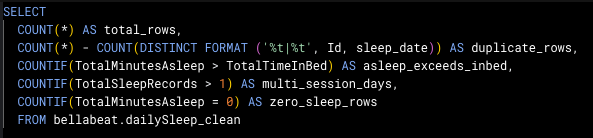  
Result: 3 duplicate rows but no zero activity and no records where sleep exceeded time in bed. There are also 46 multi-session days but were kept to reflect real usage e.g naps or fragmented sleep.   
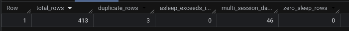  

b. Removed duplicate rows.  
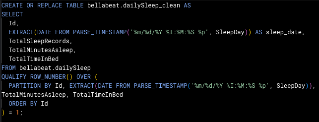

c. Checked to ensure duplicate rows were removed. 
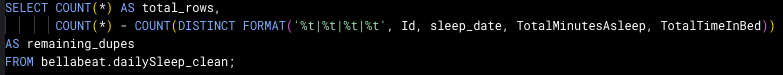  
Result: Duplicates removal confirmed  
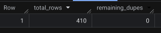

2. dailyActivity

a. Check for duplicates and zero activity entries   
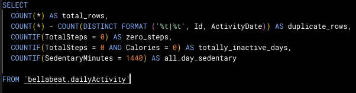  
Result: 24 duplicate rows, 138 zero step days, 9 totally inactive days and 142 days that were recorded as full sedentary days. Decided to remove the duplicate rows first then run the check again to count non-wear days  
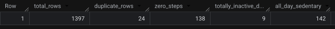  

b. Removed duplicate rows and created new column to show whether the tracker worn/not worn day.  
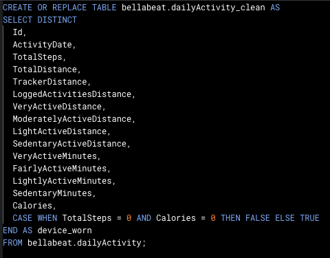  
On the assumption that the duplicate rows were identical, I applied SELECT DISTINCT * to shorten the query.  

c. Re-verification  
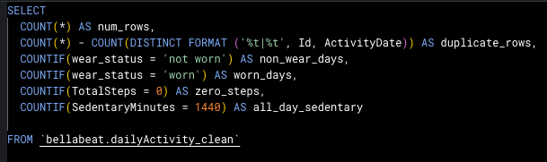  
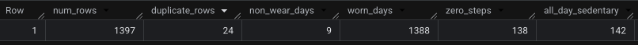  
Result: The duplicates remained  

d. Inspection to find the specific rows and looked into specific Id entries to see and compare full rows  
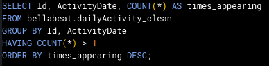  
Result:  
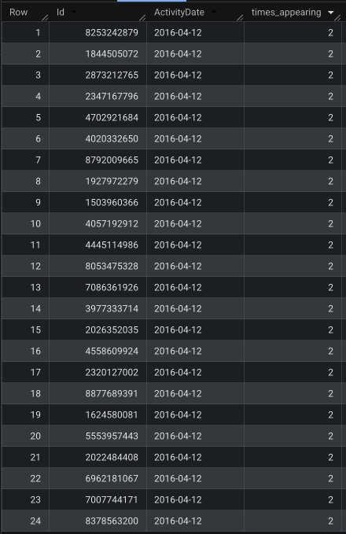  

ID 1:  
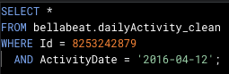  
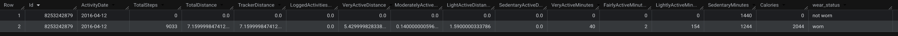  

ID 2:  
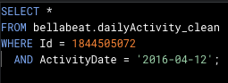  
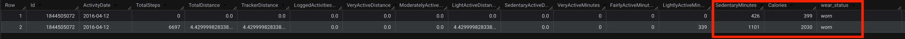  

This showed that the affected rows were not identical (hence why DISTINCT didn't work here) but were conflicting records:  
the same user and date carrying different values (one fuller activity vs near-empty record). All 24 records fell on '2016-04-12', the day where the two source files overlapped.   

e. Used QUALIFY ROW_NUMBER query to remove the conflicting rows instead  
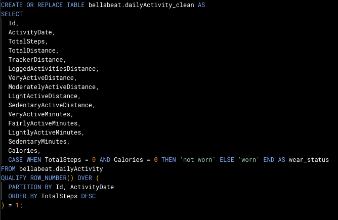  

f. Reverified results and successfully removed conflicting rows. This also lead to a fall in non_wear_days from 9 to 6 as some of the zero_records were counted from the empty half of the conflicting duplicate pair and the real record for those days showed the device was worn.   
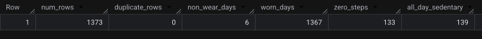  

3. hourlyIntensities   
a. Precheck  
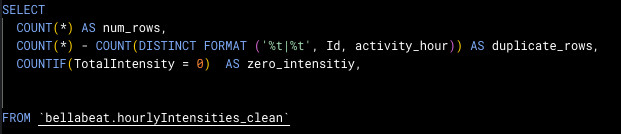   
Result: 175 duplicate rows, 20,143 zero_intensity hours.   
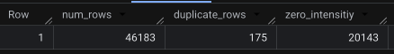   

b. Likely the same conflicting 04-12-2016 overlap as prior table so ran further checks to investigate.  
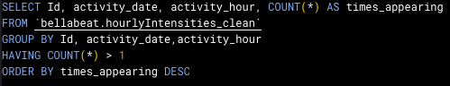   
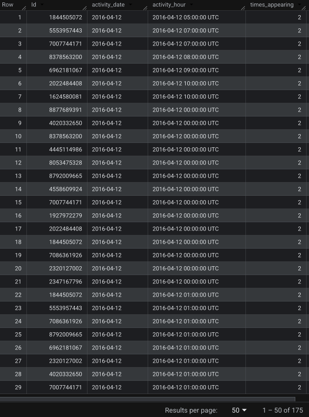  

ID 1:  
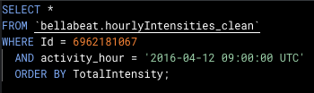  
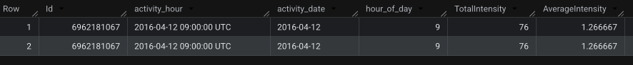  
  
ID 2:  
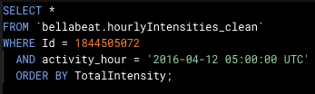  
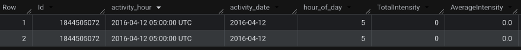  

c. With the duplicates being exact duplicates, used SELECT DISTINCT to remove them.  
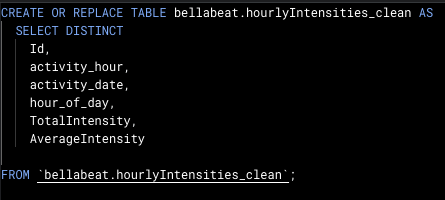  

d. Final table check: no more duplicates and removal lead to a drop from total rows 46,183 to 46,008 and zero intensity hours 20,143 to 20,027.   
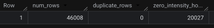   

4. hourlySteps   
a. Precheck  
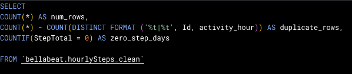  
Result: 175 duplicate rows, 20,597 zero step hours  
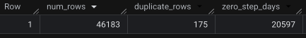  

b. Repeat of further checks like before.  
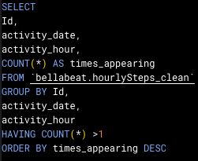   
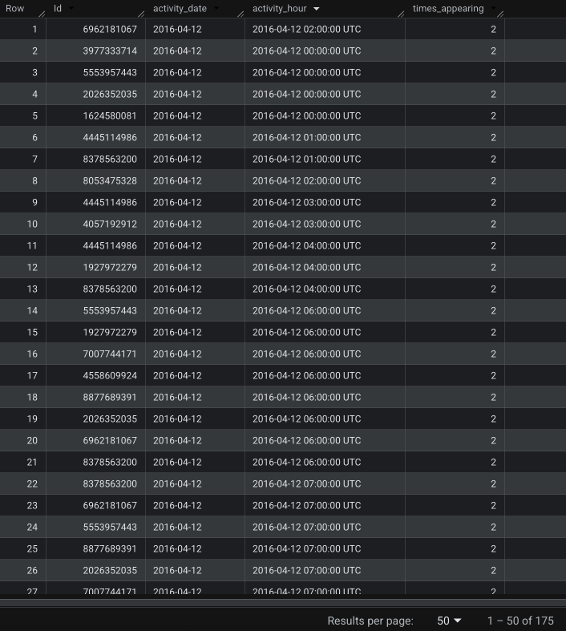   

ID 1:   
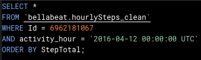   
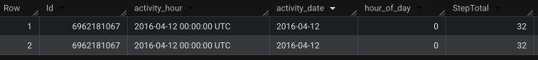  

ID 2:  
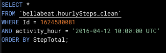  
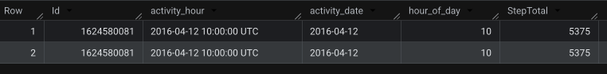  

c. Identical duplicate rows again, used SELECT DISTINCT to dedup the table and then reverified the table with same check query  
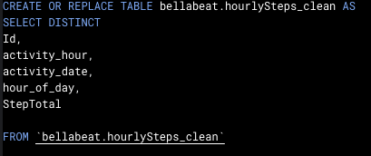  
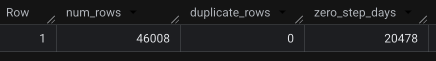  

5. hourlyCalories  
a. Precheck  
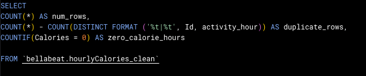  
Result: Same 175 duplicate rows but 0 zero calorie hours  
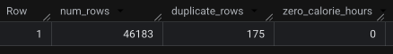  

b. Further checks of duplicates.  
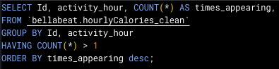   
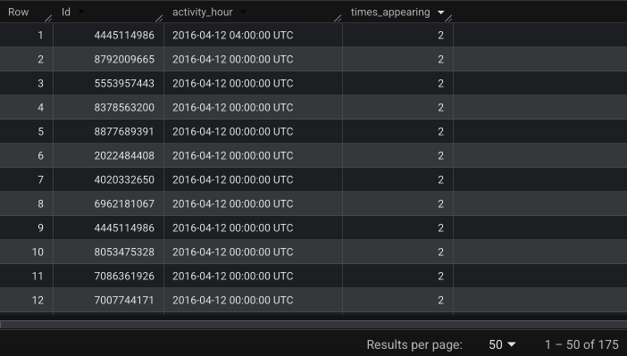   

ID 1:  
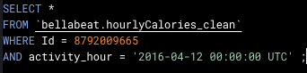  
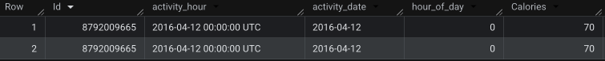  

ID 2:  
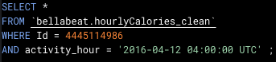  
  

c. Deduplicate rows and reverify without zero_calories_hours as that was 0  
   
   
   

  
<b>Data Prep</b>
  
  
  This was actually initiated when starting analysis. The result gave indication that most participants didn't start on 12th March but rather 1st April.   
1. I first checked the date range of dailyActivity and ensured there were no duplicate rows per-user-per-day. This search lead the result of 23 out of 35 users that start 1st April.   
  
     
     
2. Looked into individual user data i.e. when they first started and stopped appearing in the data.  
    
    
  
3. Did further checking for all other tables in the data set to confirm. 
    
  

4. Brokedown all date data to see how many users each date had  
    
     

6. Checked to see if hourly data exists for days missing from dailyActivity in case actually tracked days were dropped during cleaning  
     
     
   Result: all 593 sat before the window across 31 users which confirms that the gap is due to late enrolment and not a cleaning error

  <b>Conclusion</b>
  Analysis window: 12 April – 12 May 2016 (31 days). Full enrolment across all users, and the only period where activity, sleep and heart-rate data coexist. Note that coverage differs by data type: activity 35 users, sleep 24, heart rate 15 — so sleep and heart-rate findings describe subsets, not the full sample.     

#### Survey Data

<b>Data Loading</b>

I loaded the below csv files onto Google Sheets:
1. Responses.csv
2. Question-metadata.csv  

I've chosen to only use data from questions:  
Q7 - How important are these features for you when choosing a wearable device? (Single, 1-4, +
don’t know)  
1 = Not important at all, 4 = very important  
a. Sensor accuracy and range of values  
b. Access to several types of data (multiple sensors)  
c. Notifications from mobile phone (e.g. detection of early signs of disease)  
d. Easy to use and quality of associated mobile app  
e. Known or specific brand/price  
f. Ergonomic and design (e.g. physical design/battery consumption)  
g. Other features  

Q8 - Which features would motivate you most to use a wearable sensor longer?  
a. Relevant personalized feedback  
b. Access to aggregated summarize data on the population level  
c. Ease of use/non-disruptive  
d. Social integration (e.g. Facebook, Run Keeper)  
e. Don’t know  
f. Other   

Q9 - How important are these specific health related features for you when choosing a wearable
device? (Single, 1-4, + don’t know)  
1 = Not important at all, 4 = very important  
a. Physical activity tracking (e.g. exercise features, heart rate/pulse tracking, fatigue,
step counting, sleep tracking)  
b. Manage disease (e.g. blood glucose, pulse, oxygen, hemoglobin)   
c. Predicting and preventing symptom and health deterioration   
d. Alerts when risky behavior/when approaching limits    

Q10 - How important are these features when choosing a mobile health app? (Singe, 1-4, + I
don’t know)  
1 = Not important at all, 4 = very important  
a. Simplicity/usability  
b. Functionality/features  
c. Price  
d. Trust/security/privacy  
e. Personalization (tailored features)   

Q11 - How do you decide if a mobile app is trustworthy? (Multiple choice)  
a. In terms of security, accuracy, and usefulness, etc.  
b. Product specification/provider reputation  
c. Personal experience or other people’s experiences  
d. Certificate by independent organization/expert judgement  
e. App rating in AppStore/GooglePlay  
f. Other   

Q13 - What motivates you to collect health data? (Choose 3)  
a. Review and track progress/trend and symptoms (Know more about my health
condition)  
b. Share with others /show to my doctor (GP)  
c. Compare/compete with others  
d. Manage health and learn from previous patterns of behaviors  
e. Receive personalized health feedback  
f. Other    

Q25 - What is your age?   

Q26 - What is your gender? (male, female, other)  

Q33 - When you want to download a mobile health app, how do you choose which one to
download?  
a. Suggestion from family/friends/other patients  
b. Suggestion from health professionals  
c. Supplier advertisement/health magazine/social media  
d. Internet search (e.g. Google, Bing)  
e. Experimentation (trying things yourself, participation in research)  
f. Other   

Q38 - How important are these criteria for you to agree to install an application that collects and shares data from your wearable?
    (Single, 1-4, +I don’t know)  
1 = Not important at all, 4 = very important  
a. Automatic setup and easy to understand/use  
b. Customizable feedback  
c. Automatic data collection  
d. Non-disturbing  
e. Tailored data analysis and functionalities   

Data Extraction Map

<b>Q - Q ID - Cols - Answer type</b> 
  
Q7 - 22-28 - W-AC - Answers scale 1-4, Dont know or NA  
Q8 - 29-30 - AD-AE - Answers 6 options or Open text for 'other'  
Q9 - 31-34 - AF-AI - Answers scale 1-4, Dont know or NA  
Q10 - 35-39 -  AJ-AN - Answers scale 1-4, Dont know or NA  
Q11 - 40-45 - AO-AT - Answers 0) No, 1)Yes or Open text for 'other'  
Q13 - 47-53 - AV- BB - Answers 0) No, 1)Yes or Open text for 'other'  
Q25 - 106 - DC - 18-99 (I wanted to include this because we can maybe look all women backgrounds)  
Q26 - 107 - DD -  0)Male, 1) Female, 2) Other  
Q33 - 116-122 - DM-DS - Answers 0) No, 1)Yes or Open text for 'other'  
Q38 - 136-140 - EG-EK - Answers scale 1-4, Dont know or NA  
 
 

<b>Cleaning Steps</b>
1. Selected corresponding columns and filtered by gender = female as women are Bellabeat's target market and this will provide a good sense of direction to what incentivises women to purchase products similar to Bellabeat's. Filtering to women yielded 528 respondents.    
  

2. Used "Find & Replace" to convert all "Dont know" and "NA" values to empty cells so they're excluded from any averages.  
   Converted: 3,821 "Dont know" | 15,125 "NA"
   Note: values had to be replaced with genuinely empty cells rather than the text 'null', as text breaks numeric averaging.  

 
  
<b>Analysis</b>

<b>Fitbit Analysis</b>
  

Q1. Wear consistency, how many days out of the tracked period do people actually wear the device?  
  1. Created a view generating every user-day combination in the window, so days with no data are counted as non-wear rather than silently ignored  
    

  2. Split wear results into different bands to categorise wear consistency between users  
    
  

  3. Looked into the mean & median for all 35 users and also 33 users (as 2 users stopped syncing tracker data before 2016-04-12)  
    
    
  
Results:
- 19 of 35 users (54%) wore the device on all 31 days
- 29 of 33 active users (88%) wore it at least 80% of days.
- Median wear: 100%. Mean: 91.5% among active users, 86.3% including dropouts.
- 2 users (6%) stopped syncing before the window and never returned.
- Only 4 users sit between 12% and 65% - the middle is nearly empty
- days_with_data and days_worn were identical for all but four users, so inside the window non-wear almost never means 'device worn but inactive', it means no data at all.  

Finding: users either wear their device near-daily or stop syncing entirely. Only 4 of 35 sit anywhere in the middle. This is why mean and median diverge: the median reflects the typical user, the mean is pulled by a small tail.  

Limitation: a 31-day window shows in-window consistency only; it cannot speak to long-term retention.  

Q2. Weekly patterns: does device wear hold consistent across the week, and does activity vary by day?  
  1. Wear by day of week  
    
    

  2. Activity by day of week  
  
    

Results:  
Wear by day:  
- Range: 82.9% (Thu) to 90.0% (Fri) — a 7-point spread  
- Weekend: Sat 87.9%, Sun 86.4%  
- Thursday's low likely reflects the window's final day rather than a day-of-week effect  

Activity by day:  
- Saturday is the most active day (8,219 steps), Sunday the least (6,933). A 19% gap, showing the weekend is not a single behaviour   
- Sunday is a consistent rest day across all activity measures, while wear remains high (86.4%), i.e. users keep the device on but move less   
- Monday is the most sedentary day (1,028 mins)  

Finding: wear and activity behave independently. The device stays on all week including weekends, but movement drops sharply on Sunday showcasing that users keep wearing it even on the day they're least active. This is an engagement opportunity rather than a retention problem: the data is still being captured, so a rest-day or recovery framing has an audience that a step-based prompt does not.

Q3. Feature adoption: how many users engage with each tracking layer?

Answered by the table coverage check in Data Validation (step 3) — no additional query required.

Results:
Activity: 35 of 35 users (100%)  
Sleep: 24 of 35 (69%)  
Heart rate: 15 of 35 (43%)  

Finding: adoption falls away sharply beyond basic activity tracking. Every user generates step and activity data, but under half produce heart-rate data and only around a third track sleep consistently (Q5). Each layer beyond steps loses roughly a third of the base. The richest health signals — sleep and heart rate — reach the fewest users, which is precisely the gap a single always-on device is positioned to close.

Limitation: the dataset spans multiple Fitbit models with differing capabilities, so the gradient reflects a mix of device capability and user behaviour. It cannot be attributed to user choice alone.

Q4. Time-of-day activity: when across the day are people active?  
   
   
Results:  
- Activity spans 6am–9pm, with every hour in that range averaging 178+ steps and eleven consecutive hours above 400  
- Peak: 6pm (599 steps), followed by 7pm (583) and 5pm (550)  
- Secondary midday cluster, 12–2pm (~540 steps)  
- Overnight (midnight–5am) averages under 45 steps, with 76–86% of hours recording none  
- Sample size even across all hours (903–934 user-hours), confirming the device records continuously  

Finding: movement is distributed across the whole waking day rather than concentrated in a workout window. No single hour dominates, and the strongest period (5–7pm) accounts for only a modest share of daily steps. Most activity is incidental — commuting, errands, moving around — which is exactly what manual logging misses and passive tracking captures. The evening peak also identifies 5–7pm as the highest-engagement window for notifications or prompts.  

Note: timestamps are stored as UTC but peak times align with normal waking patterns, indicating local time. Treated as local.  

Q5. Sleep behaviour: how many users record sleep, and how consistently?
 1. Daily minute totals: distribution across worn days
 
 

 2. Daily minute totals: average per user  
   
   
 These totals were initially read as wear duration — suggesting 55% of users wore the device overnight. Cross-referencing with sleep tracking (step 3) showed the opposite: the users with the lowest minute totals track sleep most. Sleep minutes are excluded from daily activity totals, so these figures indicate whether sleep was recorded, not how long the device was worn. Step 4 verifies this — activity minutes plus time in bed sum to ~1,440 on complete days.  
 
 4. Sleep tracking per user  
   
   
 
 5. To confirm sleep+activeMinutes mechanism  
   
 

Results:  
- 24 of 35 users (69%) recorded sleep at least once; 11 (31%) never did  
- Only 10 of 35 (29%) tracked sleep on 80%+ of nights  
- 3 users (9%) tracked every night  
- 8 of the 24 trackers logged 5 nights or fewer  
- Among consistent trackers, average sleep was 6–8 hours per night  

Finding: daily wear is near-total but overnight tracking is the exception. 54% of users wore the device every single day, yet fewer than a third tracked sleep consistently. The passive daytime layer is already working; the overnight layer — Time's actual differentiator — is largely unused.

Limitations: users with fewer than ~5 nights show implausible averages (1–2 hours), likely naps or partial records. The dataset spans multiple Fitbit models, some of which cannot track sleep — so part of the 31% may reflect device capability rather than user choice.

 
<b>Survey Data</b>
  

Data description: Survey of 814 respondents, filtered to women (Q26 = 1): 528 respondents. Age range 18–98, median 41.  
Limitations: The survey samples health-tracking and chronic-disease populations rather than a general consumer sample, so preferences are directional for Bellabeat's market rather than representative of it.  
  
Attitudinal 1: What features do women rate most important in a wearable and an app?  
Attitudinal 2: What motivates longer use and how women do choose health apps?  

**Findings:**  
1. **Accuracy and simplicity beat brand and price**  
Ranked consistently across wearable features, app features and installation criteria. Brand/price ranks last for every age group evidence by the near-no gap in age difference.  
2. **Design is the biggest age divide**  
Under 45s rate ergonomics/design third (3.03) against fifth place (2.52) for 45+. That's a 0.51 gap which is the largest in the data.

3. **Retention is driven by personalised feedback and low effort - not social features**
41% and 40% respectively; social integration chosen by 2% and only 8% cite comparison as a motivation in Q13

4. **Advertising is the weakest discovery channel for health apps**
9% choose apps via advertising or social media, against 50% who try things themselves and 41% who follow a health professional's recommendation. Trust comes from personal experience (58%) and independent certification (51%).  

**Analysis steps:**   

Under each column of the cleaned data, used:
- COUNT() - to see how many of the 528 respondents answered the question (Answers "Dont know", "NA" or blank cells are excluded from averages)
- AVERAGE() - average score given
- MAX() - Highest score given (to validate that no scores exceeded the scoring scale given to each question)
And then I enlisted the help of Claude to map the results to all the questions and answer choices then converted them into readable tables. 

Formulas used: [Survey Formulas](surveyformulas.txt)  

Q7 - How important are these features for you when choosing a wearable device?  
  

Q7 by age group  
  
  
Note: nine respondents omitted age, so age-segmented figures exclude them  

Q8 - Which features would motivate you most to use a wearable sensor longer?  
  

Q8 by age group  
  
Note: nine respondents omitted age, so age-segmented figures exclude them  

Q9 - How important are these specific health related features for you when choosing a wearable
device?  

Q10 - How important are these features when choosing a mobile health app?  
  

Q11 - How do you decide if a mobile app is trustworthy?  
  

Q13 - What motivates you to collect health data?  
 

Q33 - When you want to download a mobile health app, how do you choose which one to
download?  
  

Q38 - How important are these criteria for you to agree to install an application that collects and shares data from your wearable?  
  

  i. For Q8, as it is a single choice between six options, I used COUNTIF() for each score.
 ii. For Q25, did an age breakdown
   
  

  
<b>Share</b>

  

  
<b>Recommendations</b>

    
1.<b>Time: The tracker you never take off</b>    
  
The message is "you'll forget you're even wearing it" with Time's comfort, water resistance and no charging. Time's battery solves the sleep problem. Only 29% of Fitbit users tracked sleep consistently, and 31% never did. Some Fitbits models lack sleep tracking and those that don't require regular charging, which plausibly competes with overnight wear, exactly when sleep tracking should occur. Time's coin battery lasts six months, so it never has to come off, removing charging as a barrier.
  
_Evidence: Q5 sleep tracking, Q7 ease of use 3.22, Q38 non-disturbing 3.15._  

2. <b>Win users through trial and referral, not advertising</b>  
50% discover apps by trying them, 41% via health professionals, 38% via friends — only 9% through advertising. Extend the premium trial, build referral incentives, pursue professional endorsement. Where advertising is used, message on design and simplicity rather than features.  
_Evidence: Q33, Q11 trust, Q7 design gap by age._

3. <b>Lifecycle Marketing: Make the first two weeks count </b>  
Concentrate marketing effort on the weeks immediately after purchase, because wear is bimodal and retention is decided early. Welcome sequences, early-engagement emails, first-insight prompts.
_Evidence: Q1 bimodal wear, Q38 automatic setup 3.15._

4. <b>Messaging Emphasis</b>  
Lead communications with personalised data (i.e. wellness score) and don't promote community or social sharing features as 41% of the survey respondents say personalised feedback drives continued use whereas only 2% says social integration does. Only 8% track data to compare/compete with others whereas majority track for progress (78%) & patterns (70%) and personalised feedback (55%). 
_Evidence: Q8, Q13 comparison 8%_

  
<b>Further Opportunities (outside marketing scope)</b>
  
The analysis surfaced observations relevant to product and development teams rather than marketing:   
  
- <b>Manual logging is a friction point.</b> - Time's water, menstrual cycle and meditation features require manual input, while the survey shows low effort is a primary retention driver (40% cite non-disruptive use). The wellness score partly offsets this by rewarding logging, but reducing input friction is a product opportunity. 
Idea: A double-press shortcut to log water.  

- <b>Heart rate is absent from Time</b> - In the survey, it was a bundled top rated feature so it's individual importance could not be pertained. But it's worth testing separately before future product decisions.

- <b>Invest in personalised feedback, not social features</b> - Personalised feedback is the strongest retention lever (41%) so recommendation 4 depends on the quality of the personal insights delivered - a development priority.  
  

